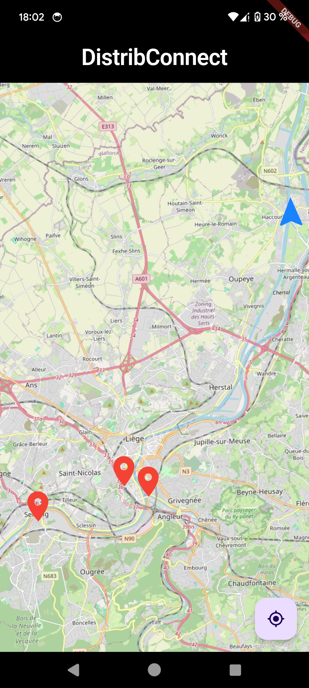
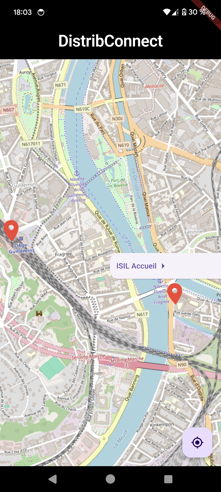
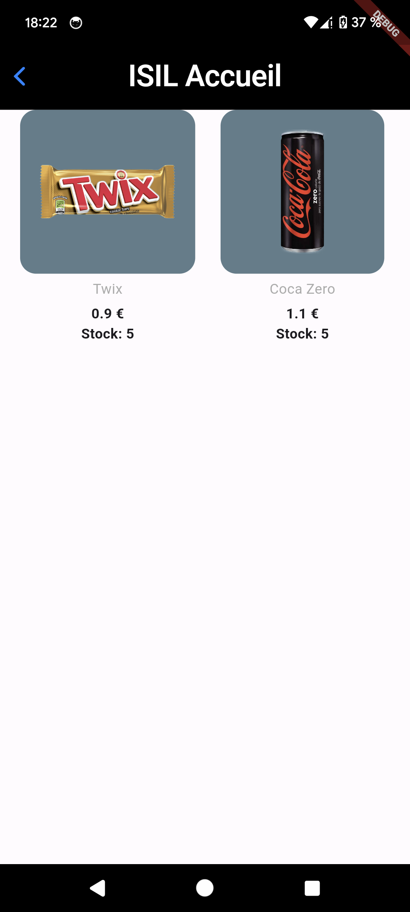
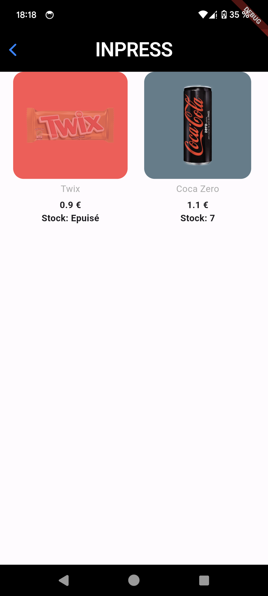
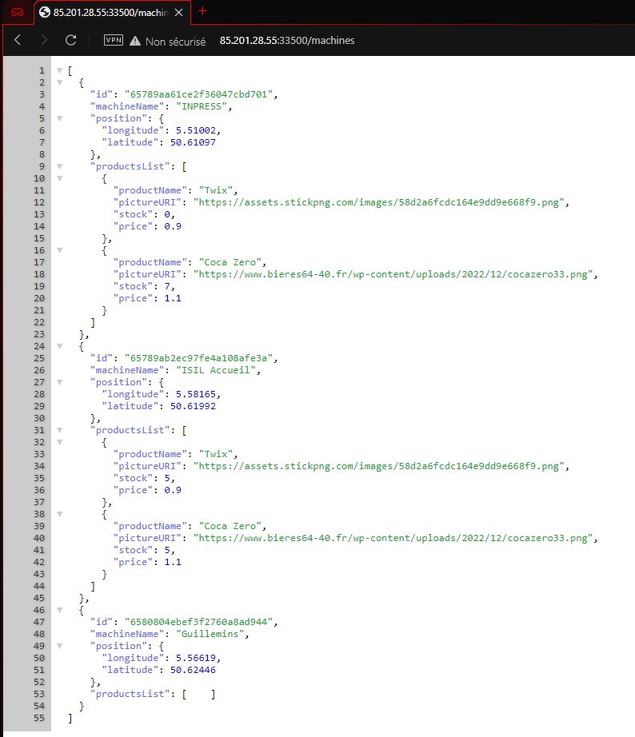

# DistribConnect

DistribConnect est une application permettant à des utilisateurs de pouvoir vérifier le stock d'un distributeur automatique spécifique.

Pour rendre la recherche de distributeur plus ergonomique, ils seront marqué sur une carte.

L'application permet aussi de réserver un ou plusieurs produits tant que l'utilisateur se connecte. Il est néanmoins nécessaire de payer les produits avant.
## 📁 Présentation des Principaux Dossiers

Les fichiers .dart sont séparés en 4 dossiers. Seul le fichier main.dart ne se situe dans aucun dossier vu qu'il ne sert qu'à lancer la première page

### Classes
Ce dossier contient les classes qui seront chargées grâce à l'API ainsi que la classe contenant les propriétés de l'application.
### Pages
Ce dossier contient les pages qui seront affichées par l'application.
### Services
Ce dossier contient les services nécessaire au bon fonctionnement de l'application. 
### Widget
Ce dossier contient tout les widgets, stateless ou non, qui seront ajouté dans d'autres widget ou dans les pages créée.

## 🚀 Présentation de l'Application

L'application démarre sur une carte centrée sur notre position (si l'application est autorisée à y accéder). On y voit des marqueurs rouge représentant les différentes machines et un bouton en bas à droite permettant de recentrer la carte sur notre position.

    

Une fois que l'on appuie sur le marqueur, le nom de la machine apparaît. Nous pouvons appuyer dessus pour ouvrir la page des produits.

    

La page des produits est interactive : si le produit est en stock, on affiche un fond bleu, sinon on affiche un fond rouge avec l'opacité de l'image réduite. Il n'y a, pour l'instant, aucune autre interaction avec l'application

    
    

## 🌐 Étude de l'Existant

Certaines applications existent, mais le principe d'affichage du stock est plutôt dirigée vers le gestionnaire et non le client de la machine. C'est le cas de Nayax.

On peut aussi parler de Box Locator, qui permet de trouver des distributeurs automatique sur une carte en affichant même le type de produit (cigarettes, boissons, snack, ...). Mais cette application ne montre pas le stock restant dans ces machines
## 🎯 Public Cible

Le principal type de client s'adresse aux personnes travaillant à proximité d'un distributeur. On peut aussi penser aux personnes participant à des évènnements sportifs ou à des touristes visitant une ville et cherchant de quoi se sustenter. 
## 📋 Fonctionnalités

En tant que client, je veux pouvoir vérifier si la machine de mon choix possède le produit de mon choix avant de me déplacer.
> Ceci est le récit utilisateur de départ. Toute l'application doit pouvoir le permettre
>
> Il faut donc une page où l'on voit les produits d'une seule machine
>
> Il faut aussi une page où l'on peut voir la liste des machines. Une liste n'étant pas ergonomique, une carte permet à l'utilisateur de choisir la machine désirée.
> 
> Une fois la machine désirée, il faut que l'utilisateur puisse voir tout les produits que la machine contient.
> Il faut que la liste soit ergonomique et puisse montrer d'un simple coup d'oeil ce qui est en stock de ce qui ne l'est pas.

En tant que client, je veux pouvoir réserver un produit de mon choix s'il est en stock
> Le client doit donc pouvoir être identifié pour sauvegarder ses réservations. 
>
>Il faut donc implémenter une classe Utilisateur dans l'API et dans le client. 
>
>Il faut aussi ajouter une page pour le client lorsque celui-ci veut voir ses informations personnelles (commandes, informations, ...).

En tant que client, je veux pouvoir accéder à l'application anonymement.
>L'application ne doit nécessiter un compte uniquement lorsque c'est nécessaire (i.e. pour la réservation d'un produit).

En tant que client, je veux pouvoir recentrer la carte sur ma position directement
>Il faut donc implémenter un bouton pour recentrer la carte sur la position du client. Il faut donc au préalable la connaître.
>
> Il n'est pas obligatoire de la connaître à chaque instant, uniquement lors du lancement et du recentrage (notre application ne devrait pas servir de carte).

## 📈 État d'Avancement

> L'application possède une carte ✔️

La carte vient de OpenStreetMap. Elle demande l'autorisation d'accéder à la position de l'utilisateur lors de son lancement.
Si ce dernier refuse, elle se centrera sur une position par défaut (ici, l'ISIL).

    

Il est à noté que le bouton en bas à droite sert à recentrer la carte sur la position du téléphone ou la position par défaut si on a toujours pas la permission.

> L'application possède une API pour les machines ✔️

L'API a été créée en Java avec Spring. Cette API est, pour l'instant, stockée localement chez le développeur.
Vu qu'aucune donnée sensible n'est encore nécessaire, aucune gestion de sécurité n'est implémentée. 

(Message aux professeurs: Oui, je n'ai pas de DNS, donc l'API est directement accédée via mon IP publique. je laisserai l'adresse accessible jusqu'au jour de l'examen).

> L'application affiche les machines sur la carte ✔️
 
Une fois les machines chargées via l'API, on doit les placer sur la carte. Pour les reconnaître, on peut utiliser des marqueurs rouges interactibles pour afficher/enlever le nom de la machine.
 
 

On peut appuyer sur le nom de la machine pour interagir et lancer la future page des produits. 

> L'application affiche une page contenant les produits ✔️
 
On doit pouvoir afficher les produits une fois la machine sélectionnée. On affichera le nom de cette dernière en grand pour que l'utilisateur soit sur d'avoir bien sélectionner la bonne machine.

Il faut donc aussi améliorer l'API pour retourner la gestion des produits.

On doit afficher les infos primordiales d'un produit (image, nom, prix et stock).
Si le produit n'est plus en stock, il faut que l'utilisateur puisse le remarquer facilement. On diminuera l'opacité de l'image, et on changera le fond de celle ci en une couleur différente.
Ici, le bleu signifie que le produit est en stock et en rouge que le stock est épuisé.

 

> L'application permet de s'authentifier à un compte ❌

Le client doit pouvoir s'authentifier. Il faut donc modifier l'API pour: 
 * Sécuriser les transactions entre l'API et l'application mobile 
 * Ajouter les informations de l'utilisateur dans la base de données

L'application doit pouvoir ensuite connecter l'utilisateur. Il faut donc une page pour que l'utilisateur entre ses données.

> L'application permet de réserver un produit ❌

Pour réserver un produit, il faut que l'icone du produit soit interagible mais aussi que l'utilisateur soit connecté. Sans cela, il sera redirigé vers la page de connexion. 
Il faut également prévoir une option panier dans le cas où l'on réserve plusieurs produits. 

Une fois la réservation effectuée, il faut la stocker dans l'API => modification obligée, mais aussi pouvoir générer un code QR pour cette commande. Il faut donc une chaîne à caractère unique (id de commande?)

> L'application possède une page pour le compte de l'utilisateur ❌
 
La page du compte doit pouvoir permettre à l'utilisateur de voir ses réservations ultérieures et donc le fameux code QR, de changer ses données personnelles...

## ⚙️ Compilation de l'Application

Une fois le projet importé via Git, il vous faudra téléchargé, si ce n'est fait, le sdk Flutter ([ici](https://docs.flutter.dev/get-started/install)). N'oubliez pas de configurer flutter dans vos variables d'environnements.

Le package flutter installé, il vous faudra lier votre version du sdk Dart (généralement dans le dossier flutter, du type flutter/bin/cache/dart-sdk). 

Une fois le SDK incorporé au projet, vous pouvez avez le choix entre deux méthodes: 
* Depuis un terminal dans le dossier du projet, effectuer `flutter pub get`
* Depuis le fichier `pubspec.yaml` cliquer sur `Pub get` (marche sur IntelliJ Idea, pas testé sur d'autres IDE)

Ces commandes vont, à l'instar de Node Package Manager pour React, installer les packages flutter ajouté au projet.

Une fois cela fait, il ne reste plus qu'à configurer l'appareil de sortie de votre projet. Vous pouvez utiliser soit un téléphone virtuel (téléchargeable avec le sdk android), soit en reliant votre téléphone directement à votre machine (le déboggage USB doit être activé).